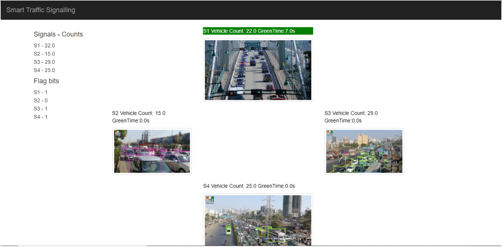
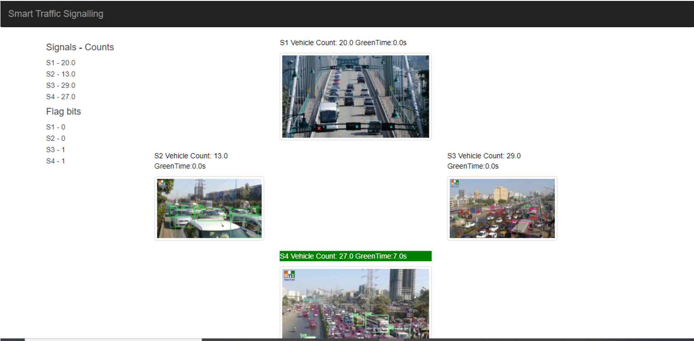

# Smart Traffic Signalling

This solution corresponds to a sequence of two major tasks: counting the number of vehicles present at a particular signal at real time and assigning signalling time based on a set of predefined rules mapping the vehicle count ranges to signalling times respectively. 4 videos have been used (see input videos folder) for simulating a signal junction. Pretrained YOLOv3 weights of of the OpenCV module are used for object detection. A robust vehicle counting task is performed, then the corresponding time for which the signal is to be set to green is assigned based on a predefined set of rules (arbitrary for now). However, a minimum and maximum threshold time for each signal is set, drawing from an appropriate queuing method, to improve efficiency.

## Installation

> Download the yolov3.weights file from this link https://www.kaggle.com/datasets/shivam316/yolov3-weights/code?resource=download , unzip and place in the project folder.\\
> Django, Pandas and numpy are required to be installed.\\
> Run assign_green.py and the django project traffic_web (cd traffic-web && python manage.py runserver) simultaneously\\
> Check output on the console and localhost:8000

## Localhost:8000 Output

